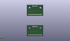
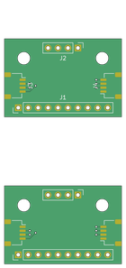

Contents
========

* [MCBI1 > ](#mcbi1--)
	* [OOMP Parts](#oomp-parts)
	* [Images](#images)
	* [Tags](#tags)
  
![][im]
# MCBI1 > 

- ID: MODULE-CONN-BRBO-IBBC-SZ01
- Hex ID: MCBI1
- Name: 
- Description: 
- Long Link: [http://oom.lt/MODULE-CONN-BRBO-IBBC-SZ01](http://oom.lt/MODULE-CONN-BRBO-IBBC-SZ01)
- Short Link: [http://oom.lt/MCBI1](http://oom.lt/MCBI1)

## OOMP Parts
  

|OOMP ID|Name|Identifier|
| :---: | :---: | :---: |
|[HEAD-I01-X-PI06-01](https://github.com/oomlout/oomlout_OOMP_parts/tree/main/HEAD-I01-X-PI06-01/)|[2.54 mm 6 Pin Header](https://github.com/oomlout/oomlout_OOMP_parts/tree/main/HEAD-I01-X-PI06-01/)|[J1, J2](https://github.com/oomlout/oomlout_OOMP_parts/tree/main/HEAD-I01-X-PI06-01/)|

## Images
  
  

|kicadPcb3d|kicadPcb3dFront|kicadPcb3dBack|kicadSchem|pcbdraw|pcbdrawback|
| :---: | :---: | :---: | :---: | :---: | :---: |
|||||||

## Tags

- oompType: MODULE
- oompSize: CONN
- oompColor: BRBO
- oompDesc: IBBC
- oompIndex: SZ01
- matchingBlock: BLOCK-CONN-I2C-EXTRA-01
- oompParts: J1,HEAD-I01-X-PI06-01
- oompParts: J2,HEAD-I01-X-PI06-01
- componentModules: M1,MODULE-CONN-I2C-QWIIC-01
- componentModules: M2,MODULE-CONN-I2C-QWIIC-01
- hexID: MCBI1
- oompID: MODULE-CONN-BRBO-IBBC-SZ01

[im]: kicadPcb3d_450.png
