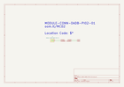

Contents
========

* [MCD2 > 2 Pin](#mcd2--2-pin)
	* [Images](#images)
	* [Tags](#tags)
  
![][im]
# MCD2 > 2 Pin

- ID: MODULE-CONN-DADB-PI02-01
- Hex ID: MCD2
- Name: 2 Pin
- Description: 2 Pin
- Long Link: [http://oom.lt/MODULE-CONN-DADB-PI02-01](http://oom.lt/MODULE-CONN-DADB-PI02-01)
- Short Link: [http://oom.lt/MCD2](http://oom.lt/MCD2)

## Images
  
  

|kicadPcb3d|kicadPcb3dFront|kicadPcb3dBack|kicadSchem|
| :---: | :---: | :---: | :---: |
|||||

## Tags

- oompType: MODULE
- oompSize: CONN
- oompColor: DADB
- oompDesc: PI02
- oompIndex: 01
- hexID: MCD2
- oompID: MODULE-CONN-DADB-PI02-01

[im]: kicadPcb3d_450.png
