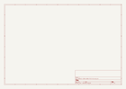

Contents
========

* [MCD13 > 13 Pin](#mcd13--13-pin)
	* [Images](#images)
	* [Tags](#tags)
  
![][im]
# MCD13 > 13 Pin

- ID: MODULE-CONN-DADB-PI13-01
- Hex ID: MCD13
- Name: 13 Pin
- Description: 13 Pin
- Long Link: [http://oom.lt/MODULE-CONN-DADB-PI13-01](http://oom.lt/MODULE-CONN-DADB-PI13-01)
- Short Link: [http://oom.lt/MCD13](http://oom.lt/MCD13)

## Images
  
  

|kicadPcb3d|kicadPcb3dFront|kicadPcb3dBack|kicadSchem|
| :---: | :---: | :---: | :---: |
|||||

## Tags

- oompType: MODULE
- oompSize: CONN
- oompColor: DADB
- oompDesc: PI13
- oompIndex: 01
- componentModules: M1,MODULE-MCUU-K328-MUR-01
- componentModules: M1,MODULE-CONN-DADB-PI03-01
- componentModules: M2,MODULE-CONN-DADB-PI16-01
- componentModules: M3,MODULE-CONN-DADB-PI16-01
- hexID: MCD13
- oompID: MODULE-CONN-DADB-PI13-01

[im]: kicadPcb3d_450.png
