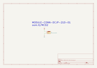

Contents
========

* [MCD2 > ](#mcd2--)
	* [OOMP Parts](#oomp-parts)
	* [Images](#images)
	* [Tags](#tags)
  
![][im]
# MCD2 > 

- ID: MODULE-CONN-DCJP-21D-01
- Hex ID: MCD2
- Name: 
- Description: 
- Long Link: [http://oom.lt/MODULE-CONN-DCJP-21D-01](http://oom.lt/MODULE-CONN-DCJP-21D-01)
- Short Link: [http://oom.lt/MCD2](http://oom.lt/MCD2)

## OOMP Parts
  

|OOMP ID|Name|Identifier|
| :---: | :---: | :---: |
|[DCJP-21D-X-STAN-01](https://github.com/oomlout/oomlout_OOMP_parts/tree/main/DCJP-21D-X-STAN-01/)|[2.1 mm DC Jack](https://github.com/oomlout/oomlout_OOMP_parts/tree/main/DCJP-21D-X-STAN-01/)|[J1](https://github.com/oomlout/oomlout_OOMP_parts/tree/main/DCJP-21D-X-STAN-01/)|

## Images
  
  

|kicadPcb3d|kicadPcb3dFront|kicadPcb3dBack|kicadSchem|
| :---: | :---: | :---: | :---: |
|||||

## Tags

- oompType: MODULE
- oompSize: CONN
- oompColor: DCJP
- oompDesc: 21D
- oompIndex: 01
- matchingBlock: BLOCK-CONN-POWE-STAN-01
- oompParts: J1,DCJP-21D-X-STAN-01
- hexID: MCD2
- oompID: MODULE-CONN-DCJP-21D-01

[im]: kicadPcb3d_450.png
