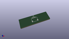
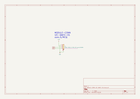

Contents
========

* [MCQ > ](#mcq--)
	* [OOMP Parts](#oomp-parts)
	* [Images](#images)
	* [Tags](#tags)
  
![][im]
# MCQ > 

- ID: MODULE-CONN-I2C-QWIIC-01
- Hex ID: MCQ
- Name: 
- Description: 
- Long Link: [http://oom.lt/MODULE-CONN-I2C-QWIIC-01](http://oom.lt/MODULE-CONN-I2C-QWIIC-01)
- Short Link: [http://oom.lt/MCQ](http://oom.lt/MCQ)

## OOMP Parts
  

|OOMP ID|Name|Identifier|
| :---: | :---: | :---: |
|[HEAD-JSTSH-X-PI04-RS](https://github.com/oomlout/oomlout_OOMP_parts/tree/main/HEAD-JSTSH-X-PI04-RS/)|[JST XH (1 mm) 4 Pin Header Right Angle (SMD)](https://github.com/oomlout/oomlout_OOMP_parts/tree/main/HEAD-JSTSH-X-PI04-RS/)|[J1](https://github.com/oomlout/oomlout_OOMP_parts/tree/main/HEAD-JSTSH-X-PI04-RS/)|

## Images
  
  

|kicadPcb3d|kicadPcb3dFront|kicadPcb3dBack|kicadSchem|
| :---: | :---: | :---: | :---: |
|||||

## Tags

- oompType: MODULE
- oompSize: CONN
- oompColor: I2C
- oompDesc: QWIIC
- oompIndex: 01
- matchingBlock: BLOCK-CONN-I2C-STAN-01
- oompParts: J1,HEAD-JSTSH-X-PI04-RS
- hexID: MCQ
- oompID: MODULE-CONN-I2C-QWIIC-01

[im]: kicadPcb3d_450.png
