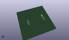
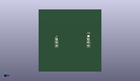
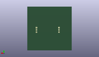
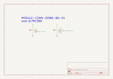
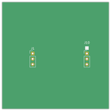
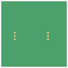

Contents
========

* [MCOBA > ](#mcoba--)
	* [OOMP Parts](#oomp-parts)
	* [Images](#images)
	* [Tags](#tags)
  
![][im]
# MCOBA > 

- ID: MODULE-CONN-OOBB-BA-01
- Hex ID: MCOBA
- Name: 
- Description: 
- Long Link: [http://oom.lt/MODULE-CONN-OOBB-BA-01](http://oom.lt/MODULE-CONN-OOBB-BA-01)
- Short Link: [http://oom.lt/MCOBA](http://oom.lt/MCOBA)

## OOMP Parts
  

|OOMP ID|Name|Identifier|
| :---: | :---: | :---: |
|[HEAD-I01-X-PI03-RA](https://github.com/oomlout/oomlout_OOMP_parts/tree/main/HEAD-I01-X-PI03-RA/)|[2.54 mm 3 Pin Header Right Angle](https://github.com/oomlout/oomlout_OOMP_parts/tree/main/HEAD-I01-X-PI03-RA/)|[J1](https://github.com/oomlout/oomlout_OOMP_parts/tree/main/HEAD-I01-X-PI03-RA/)|

## Images
  
  

|kicadPcb3d|kicadPcb3dFront|kicadPcb3dBack|kicadSchem|pcbdraw|pcbdrawback|
| :---: | :---: | :---: | :---: | :---: | :---: |
|||||||

## Tags

- oompType: MODULE
- oompSize: CONN
- oompColor: OOBB
- oompDesc: BA
- oompIndex: 01
- matchingBlock: BLOCK-CONN-OOBB-BA-01
- oompParts: J1,HEAD-I01-X-PI03-RA
- hexID: MCOBA
- oompID: MODULE-CONN-OOBB-BA-01

[im]: kicadPcb3d_450.png
