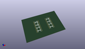
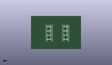
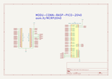
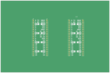

Contents
========

* [MCRP2040 > ](#mcrp2040--)
	* [OOMP Parts](#oomp-parts)
	* [Images](#images)
	* [Tags](#tags)
  
![][im]
# MCRP2040 > 

- ID: MODULE-CONN-RASP-PICO-2040
- Hex ID: MCRP2040
- Name: 
- Description: 
- Long Link: [http://oom.lt/MODULE-CONN-RASP-PICO-2040](http://oom.lt/MODULE-CONN-RASP-PICO-2040)
- Short Link: [http://oom.lt/MCRP2040](http://oom.lt/MCRP2040)

## OOMP Parts
  

|OOMP ID|Name|Identifier|
| :---: | :---: | :---: |
|[HEAD-I01-X-PI20-01](https://github.com/oomlout/oomlout_OOMP_parts/tree/main/HEAD-I01-X-PI20-01/)|[2.54 mm 20 Pin Header](https://github.com/oomlout/oomlout_OOMP_parts/tree/main/HEAD-I01-X-PI20-01/)|[J1, J2](https://github.com/oomlout/oomlout_OOMP_parts/tree/main/HEAD-I01-X-PI20-01/)|

## Images
  
  

|kicadPcb3d|kicadPcb3dFront|kicadPcb3dBack|kicadSchem|pcbdraw|pcbdrawback|
| :---: | :---: | :---: | :---: | :---: | :---: |
|||||||

## Tags

- oompType: MODULE
- oompSize: CONN
- oompColor: RASP
- oompDesc: PICO
- oompIndex: 2040
- matchingBlock: BLOCK-CONN-RASP-PICO-2040
- oompParts: J1,HEAD-I01-X-PI20-01
- oompParts: J2,HEAD-I01-X-PI20-01
- hexID: MCRP2040
- oompID: MODULE-CONN-RASP-PICO-2040

[im]: kicadPcb3d_450.png
