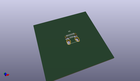
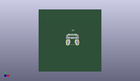
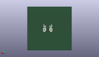
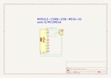
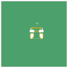
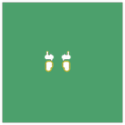

Contents
========

* [MCUMEGA > ](#mcumega--)
	* [OOMP Parts](#oomp-parts)
	* [Images](#images)
	* [Tags](#tags)
  
![][im]
# MCUMEGA > 

- ID: MODULE-CONN-USB-MEGA-01
- Hex ID: MCUMEGA
- Name: 
- Description: 
- Long Link: [http://oom.lt/MODULE-CONN-USB-MEGA-01](http://oom.lt/MODULE-CONN-USB-MEGA-01)
- Short Link: [http://oom.lt/MCUMEGA](http://oom.lt/MCUMEGA)

## OOMP Parts
  

|OOMP ID|Name|Identifier|
| :---: | :---: | :---: |
|||J1|

## Images
  
  

|kicadPcb3d|kicadPcb3dFront|kicadPcb3dBack|kicadSchem|pcbdraw|pcbdrawback|
| :---: | :---: | :---: | :---: | :---: | :---: |
|||||||

## Tags

- oompType: MODULE
- oompSize: CONN
- oompColor: USB
- oompDesc: MEGA
- oompIndex: 01
- oompParts: J1,
- hexID: MCUMEGA
- oompID: MODULE-CONN-USB-MEGA-01

[im]: kicadPcb3d_450.png
