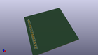

Contents
========

* [MDCI15 > ](#mdci15--)
	* [Images](#images)
	* [Tags](#tags)
  
![][im]
# MDCI15 > 

- ID: MODULE-DADB-CONN-HEADI01PI15-01
- Hex ID: MDCI15
- Name: 
- Description: 
- Long Link: [http://oom.lt/MODULE-DADB-CONN-HEADI01PI15-01](http://oom.lt/MODULE-DADB-CONN-HEADI01PI15-01)
- Short Link: [http://oom.lt/MDCI15](http://oom.lt/MDCI15)

## Images
  
  

|kicadPcb3d|kicadPcb3dFront|kicadPcb3dBack|kicadSchem|
| :---: | :---: | :---: | :---: |
|||||

## Tags

- oompType: MODULE
- oompSize: DADB
- oompColor: CONN
- oompDesc: HEADI01PI15
- oompIndex: 01
- hexID: MDCI15
- oompID: MODULE-DADB-CONN-HEADI01PI15-01

[im]: kicadPcb3d_450.png
