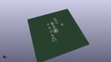

Contents
========

* [MD328M > AtMega328P](#md328m--atmega328p)
	* [Images](#images)
	* [Tags](#tags)
  
![][im]
# MD328M > AtMega328P

- ID: MODULE-DADB-MCUU-K328-01
- Hex ID: MD328M
- Name: AtMega328P
- Description: AtMega328P
- Long Link: [http://oom.lt/MODULE-DADB-MCUU-K328-01](http://oom.lt/MODULE-DADB-MCUU-K328-01)
- Short Link: [http://oom.lt/MD328M](http://oom.lt/MD328M)

## Images
  
  

|kicadPcb3d|kicadPcb3dFront|kicadPcb3dBack|kicadSchem|
| :---: | :---: | :---: | :---: |
|||||

## Tags

- oompType: MODULE
- oompSize: DADB
- oompColor: MCUU
- oompDesc: K328
- oompIndex: 01
- hexID: MD328M
- oompID: MODULE-DADB-MCUU-K328-01

[im]: kicadPcb3d_450.png
