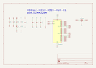

Contents
========

* [MM328M > ](#mm328m--)
	* [Images](#images)
	* [Tags](#tags)
  
![][im]
# MM328M > 

- ID: MODULE-MCUU-K328-MUR-01
- Hex ID: MM328M
- Name: 
- Description: 
- Long Link: [http://oom.lt/MODULE-MCUU-K328-MUR-01](http://oom.lt/MODULE-MCUU-K328-MUR-01)
- Short Link: [http://oom.lt/MM328M](http://oom.lt/MM328M)

## Images
  
  

|kicadPcb3d|kicadPcb3dFront|kicadPcb3dBack|kicadSchem|
| :---: | :---: | :---: | :---: |
|||||

## Tags

- oompType: MODULE
- oompSize: MCUU
- oompColor: K328
- oompDesc: MUR
- oompIndex: 01
- hexID: MM328M
- oompID: MODULE-MCUU-K328-MUR-01

[im]: kicadPcb3d_450.png
