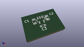
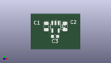
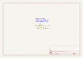

Contents
========

* [MP2112 > ](#mp2112--)
	* [OOMP Parts](#oomp-parts)
	* [Images](#images)
	* [Tags](#tags)
  
![][im]
# MP2112 > 

- ID: MODULE-POWE-KAP2112K-STAN-01
- Hex ID: MP2112
- Name: 
- Description: 
- Long Link: [http://oom.lt/MODULE-POWE-KAP2112K-STAN-01](http://oom.lt/MODULE-POWE-KAP2112K-STAN-01)
- Short Link: [http://oom.lt/MP2112](http://oom.lt/MP2112)

## OOMP Parts
  

|OOMP ID|Name|Identifier|
| :---: | :---: | :---: |
|[VREG-SO235-X-KAP2112K-V33D](https://github.com/oomlout/oomlout_OOMP_parts/tree/main/VREG-SO235-X-KAP2112K-V33D/)|[SMD (SOT-23-5) AP2112K Voltage Regulator 3.3v](https://github.com/oomlout/oomlout_OOMP_parts/tree/main/VREG-SO235-X-KAP2112K-V33D/)|[U1](https://github.com/oomlout/oomlout_OOMP_parts/tree/main/VREG-SO235-X-KAP2112K-V33D/)|

## Images
  
  

|kicadPcb3d|kicadPcb3dFront|kicadPcb3dBack|kicadSchem|
| :---: | :---: | :---: | :---: |
|||||

## Tags

- oompType: MODULE
- oompSize: POWE
- oompColor: KAP2112K
- oompDesc: STAN
- oompIndex: 01
- matchingBlock: BLOCK-POW-STAN-STAN-01
- oompParts: U1,VREG-SO235-X-KAP2112K-V33D
- hexID: MP2112
- oompID: MODULE-POWE-KAP2112K-STAN-01

[im]: kicadPcb3d_450.png
