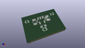
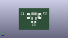
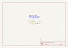

Contents
========

* [MP21123 > 3.3v](#mp21123--33v)
	* [OOMP Parts](#oomp-parts)
	* [Images](#images)
	* [Tags](#tags)
  
![][im]
# MP21123 > 3.3v

- ID: MODULE-POWE-KAP2112K-V33D-01
- Hex ID: MP21123
- Name: 3.3v
- Description: 3.3v
- Long Link: [http://oom.lt/MODULE-POWE-KAP2112K-V33D-01](http://oom.lt/MODULE-POWE-KAP2112K-V33D-01)
- Short Link: [http://oom.lt/MP21123](http://oom.lt/MP21123)

## OOMP Parts
  

|OOMP ID|Name|Identifier|
| :---: | :---: | :---: |
|[SENS-LG14-X-K345-01](https://github.com/oomlout/oomlout_OOMP_parts/tree/main/SENS-LG14-X-K345-01/)|[14 Pin SMD (LGA) Digital Accelerometer (ADXL345) Sensor](https://github.com/oomlout/oomlout_OOMP_parts/tree/main/SENS-LG14-X-K345-01/)|[U1](https://github.com/oomlout/oomlout_OOMP_parts/tree/main/SENS-LG14-X-K345-01/)|

## Images
  
  

|kicadPcb3d|kicadPcb3dFront|kicadPcb3dBack|kicadSchem|
| :---: | :---: | :---: | :---: |
|||||

## Tags

- oompType: MODULE
- oompSize: POWE
- oompColor: KAP2112K
- oompDesc: V33D
- oompIndex: 01
- matchingBlock: BLOCK-SENS-ACCEL-I2C-01
- oompParts: U1,SENS-LG14-X-K345-01
- hexID: MP21123
- oompID: MODULE-POWE-KAP2112K-V33D-01

[im]: kicadPcb3d_450.png
