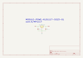

Contents
========

* [MP1117 > ](#mp1117--)
	* [OOMP Parts](#oomp-parts)
	* [Images](#images)
	* [Tags](#tags)
  
![][im]
# MP1117 > 

- ID: MODULE-POWE-KLD1117-SO23-01
- Hex ID: MP1117
- Name: 
- Description: 
- Long Link: [http://oom.lt/MODULE-POWE-KLD1117-SO23-01](http://oom.lt/MODULE-POWE-KLD1117-SO23-01)
- Short Link: [http://oom.lt/MP1117](http://oom.lt/MP1117)

## OOMP Parts
  

|OOMP ID|Name|Identifier|
| :---: | :---: | :---: |
|[VREG-SO223-X-KLD1117-V33D](https://github.com/oomlout/oomlout_OOMP_parts/tree/main/VREG-SO223-X-KLD1117-V33D/)|[SMD (SOT-223) LD1117 Voltage Regulator 3.3v](https://github.com/oomlout/oomlout_OOMP_parts/tree/main/VREG-SO223-X-KLD1117-V33D/)|[U1](https://github.com/oomlout/oomlout_OOMP_parts/tree/main/VREG-SO223-X-KLD1117-V33D/)|

## Images
  
  

|kicadPcb3d|kicadPcb3dFront|kicadPcb3dBack|kicadSchem|
| :---: | :---: | :---: | :---: |
|||||

## Tags

- oompType: MODULE
- oompSize: POWE
- oompColor: KLD1117
- oompDesc: SO23
- oompIndex: 01
- matchingBlock: BLOCK-POW-STAN-STAN-01
- oompParts: U1,VREG-SO223-X-KLD1117-V33D
- hexID: MP1117
- oompID: MODULE-POWE-KLD1117-SO23-01

[im]: kicadPcb3d_450.png
