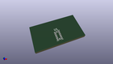
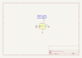

Contents
========

* [MS345 > ](#ms345--)
	* [OOMP Parts](#oomp-parts)
	* [Images](#images)
	* [Tags](#tags)
  
![][im]
# MS345 > 

- ID: MODULE-SENS-K345-STAN-01
- Hex ID: MS345
- Name: 
- Description: 
- Long Link: [http://oom.lt/MODULE-SENS-K345-STAN-01](http://oom.lt/MODULE-SENS-K345-STAN-01)
- Short Link: [http://oom.lt/MS345](http://oom.lt/MS345)

## OOMP Parts
  

|OOMP ID|Name|Identifier|
| :---: | :---: | :---: |
|[SENS-LG14-X-K345-01](https://github.com/oomlout/oomlout_OOMP_parts/tree/main/SENS-LG14-X-K345-01/)|[14 Pin SMD (LGA) Digital Accelerometer (ADXL345) Sensor](https://github.com/oomlout/oomlout_OOMP_parts/tree/main/SENS-LG14-X-K345-01/)|[U1](https://github.com/oomlout/oomlout_OOMP_parts/tree/main/SENS-LG14-X-K345-01/)|

## Images
  
  

|kicadPcb3d|kicadPcb3dFront|kicadPcb3dBack|kicadSchem|
| :---: | :---: | :---: | :---: |
|||||

## Tags

- oompType: MODULE
- oompSize: SENS
- oompColor: K345
- oompDesc: STAN
- oompIndex: 01
- matchingBlock: BLOCK-SENS-ACCEL-I2C-01
- oompParts: U1,SENS-LG14-X-K345-01
- hexID: MS345
- oompID: MODULE-SENS-K345-STAN-01

[im]: kicadPcb3d_450.png
